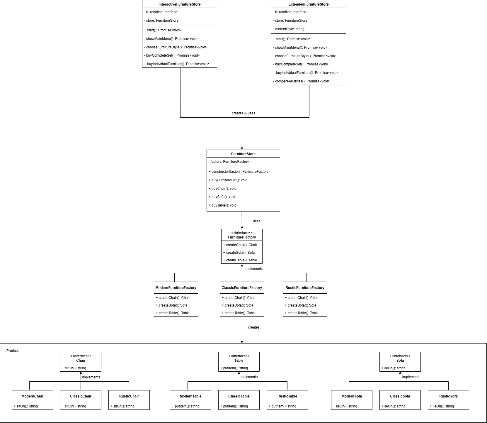

# Interactive Furniture Store - Abstract Factory Pattern

A simple TypeScript implementation of the Abstract Factory design pattern with an interactive console interface.

## Overview

This project implements a furniture store where customers can purchase matching furniture sets. The Abstract Factory pattern ensures that all furniture pieces within a selected style are consistent.

## Project Structure

```
├── asset/
|   └── Abstract.png
├── src/
│   ├── models/
│   │   └── productInterfaces.ts    # Product interfaces
│   ├── products/
│   │   ├── modernFurniture.ts      # Modern implementations
│   │   ├── classicFurniture.ts     # Classic implementations
│   │   └── rusticFurniture.ts      # Rustic implementations
│   ├── factories/
│   │   ├── furnitureFactory.ts     # Abstract factory
│   │   └── concreteFactories.ts    # Concrete factories
│   ├── client/
│   │   └── furnitureStore.ts       # Store client
│   └── ui/
│       ├── interactiveStore.ts     # Interactive interface
│       └── demo.ts                 # Demo version
├── main.ts                         # Entry point
├── package.json
└── tsconfig.json
```

## UML Class Diagram



## Installation

```bash
git clone <repository-url>
cd furniture-abstract-factory
npm install
```

## Usage

```bash
# Interactive mode
npm start

# Demo mode
npm run demo
```

## Pattern Implementation

### Abstract Products

```typescript
export interface Chair {
  sitOn(): string;
}

export interface Sofa {
  lieOn(): string;
}

export interface Table {
  putItem(): string;
}
```

### Concrete Factories

- `ModernFurnitureFactory` - Creates modern style furniture
- `ClassicFurnitureFactory` - Creates classic style furniture
- `RusticFurnitureFactory` - Creates rustic style furniture

## Example Usage

```typescript
const modernFactory = new ModernFurnitureFactory();
const store = new FurnitureStore(modernFactory);
store.buyFurnitureSet();
```

## Built By

Ms Hamsini S
